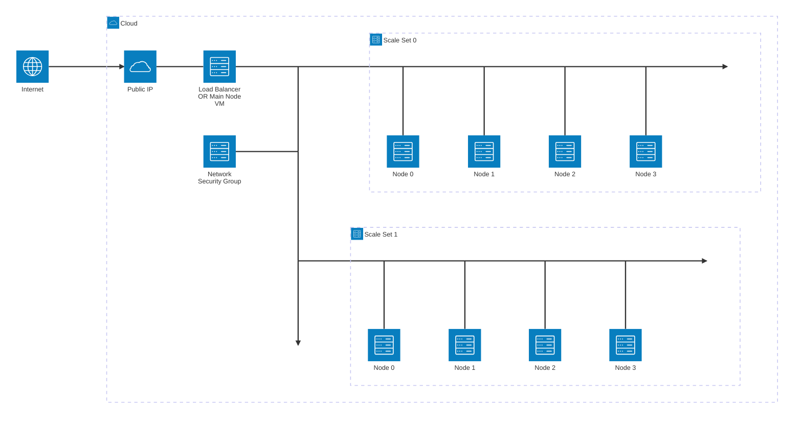
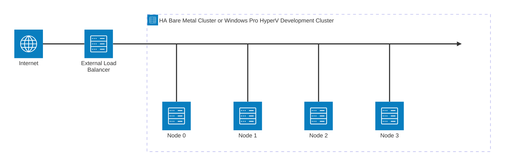
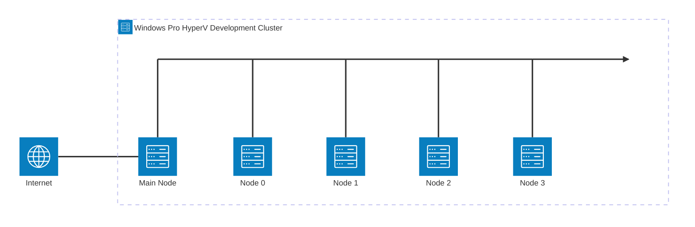
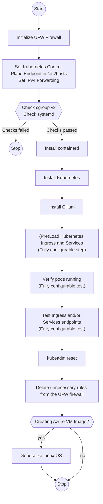
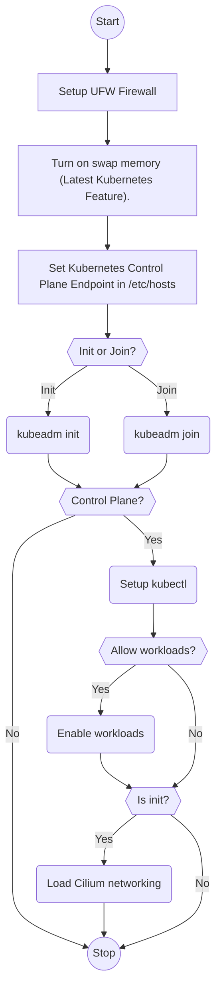
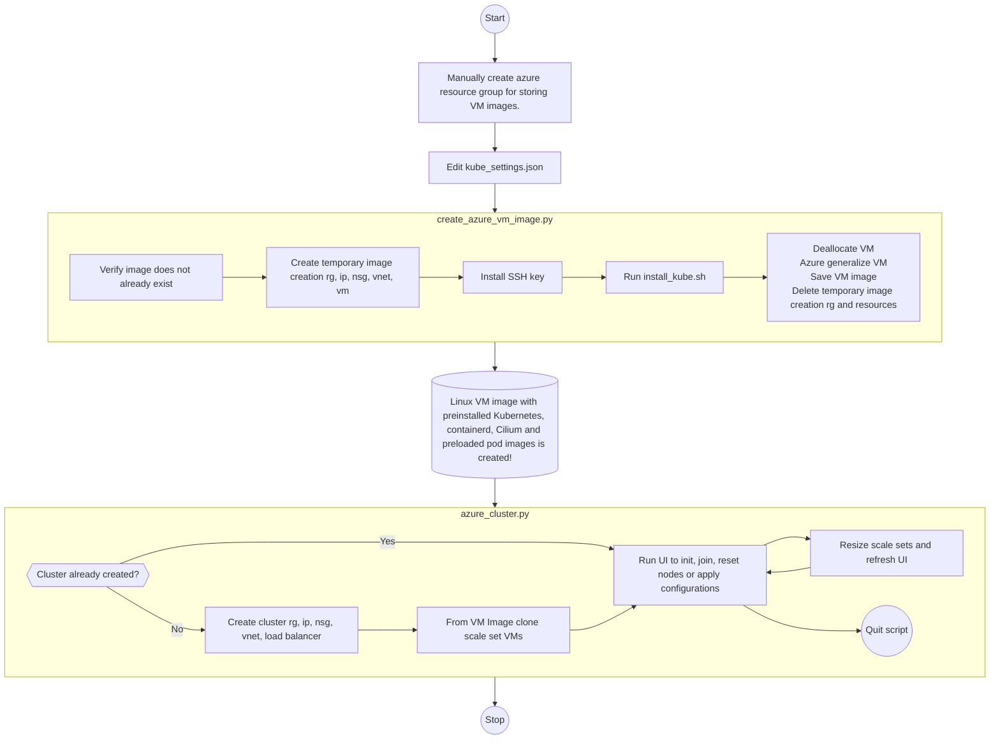
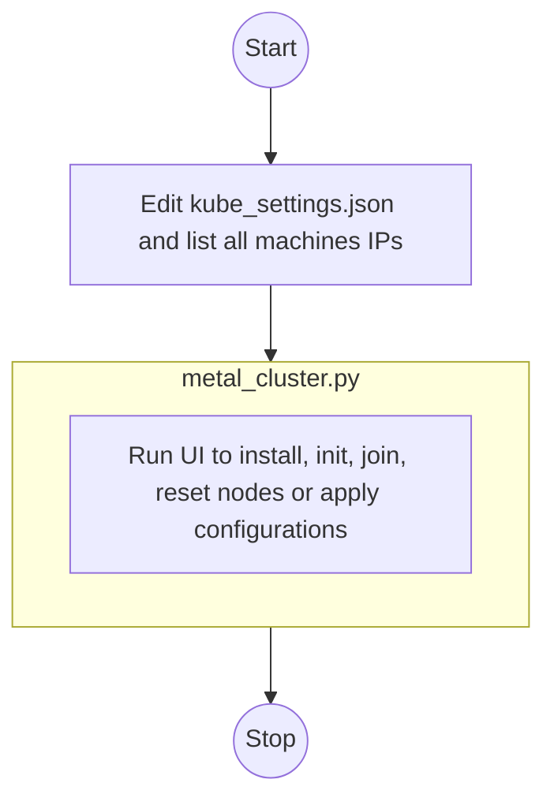

  Copyright (C) 2024 Tomislav Markoc, unpublished work. All rights reserved.
  Title and version: KubernetesCluster, version 2.0

  This is an unpublished work registered with the U.S. Copyright Office. As
  per https://www.copyright.gov/comp3/chap1900/ch1900-publication.pdf and
  https://www.govinfo.gov/content/pkg/USCODE-2011-title17/pdf/USCODE-2011-title17-chap1-sec101.pdf,
  public performance or a public display of a work "does not of itself
  constitute publication." Therefore, you only have permission to view this
  work in your web browser.

  You do not do not have permission to make copies by downloading files,
  copy and paste texts, use git clone, clone, fork, or use any other means
  to make copies of this work.

  If you make a copy of this work, you must delete it immediately.

  You do not have permission to modify this work or create derivative work.

  You do not have permission to use this work for any Artificial Intelligence
  (AI) purposes, including and not limited to training AI models or
  generative AI.

  By hosting this work you accept this agreement.

  In the case of conflict this licensing agreement takes precedence over all
  other agreements.

  In the case any provision of this licensing agreement is invalid or
  unenforceable, any invalidity or unenforceability will affect only that
  provision.

  ---------------------------------------------------------------------------

  Copyright statutory damages are up to $150,000 for willful infringement.
  Other damages may be more.

  This work was created without AI assistance. Therefore, the copyright
  status is clear.

  For info about this work or demo, contact me at tmarkoc@hotmail.com.

# Introduction
This project consists of a set of python and bash scripts that can be used to easily and quickly create native Kubernetes cluster. This is a fully functional, pure Kubernetes system capable of creating HA Cluster on a cloud, bare metal cluster or cluster using Hyper-V VM-s on a Windows Pro laptop. This project does not try to replace kubeadm and kubectl, it just makes it much easier to create native Kubernetes cluster so kubeadm and kubectl can be used to operate the cluster. This project does not use MiniKube, MicroK8s or similar technologies.

Cluster is created by using Ubuntu Servers (or Ubuntu Desktops for development purposes), and by using containerd and Cilium. Memory to disk swapping is turned on (new Kubernetes feature).

Approach taken is to first create OS image with Kubernetes preinstalled and container images preloaded. Then, from this image it is possible to create new Kubernetes nodes and join them to the cluster in a matter of a few dozen seconds. This way it is even possible to recreate entire cluster very quickly.

# Supported Configurations
## Azure Cluster (HA Production Cluster or Dev/Test Cluster)
Any number of Scale Sets and VM-s, up to the Azure limit. Scale sets can be either with Reserved or with Spot pricing.

For HA production cluster, load balancer is used.
For Dev/Test cluster, load balancer is replaced with a reserved instance VM.

## HA Bare Metal Cluster

## Dev Cluster made of Hyper-V VMs on Windows Pro

# Cluster Creation
Recommended way to use the installation scripts is to create an Linux operating system image with preinstalled Kubernetes, and then quickly clone VM-s from that image. Once cloned VM is running, initialization script is used to provide all the necessary parameters and quickly execute "kubeadm init" or "kubeadm join". Alternatively, scripts can be used to install Kubernetes individualy on each machine, and then initialize and join the cluster.

## install_kube.sh - Script for Kubernetes Installation on Linux

## initialize_kube_node.sh - Linux script for Kubernetes Cluster Initialization and Node Joining

## Azure Cluster Creation

## Bare Metal or Windows Pro Hyper-V VM Cluster Creation

You can either use script to install Kubernetes on each machine separately, or install on one machine and then manually create .ISO image or VM image and then clone many machines from that image. After machines are installed or cloned, use script again to init, join, reset nodes or apply cluster configurations.

